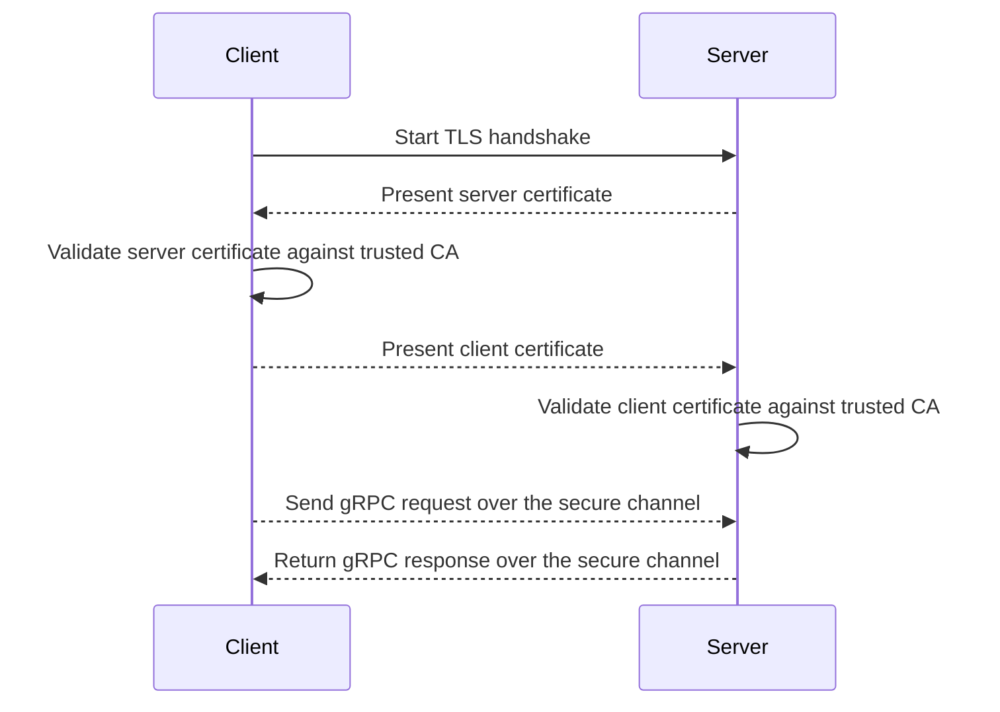

This note is based on Handra's article, [Secure gRPC Client/Server over mTLS](https://www.handracs.info/blog/grpcmtlsgo/), but uses the implementation patterns from [liambeeton/mbank](https://github.com/liambeeton/mbank) so the examples reflect a fuller Go project rather than a single-file demo.

## Core idea

mTLS means both sides present certificates:

- the client verifies the server certificate
- the server verifies the client certificate
- both sides trust the same CA

In Go gRPC, that usually comes down to four steps:

- load a cert and key with `tls.LoadX509KeyPair`
- build an `x509.CertPool` from the CA certificate
- create transport credentials with `credentials.NewTLS(...)`
- pass those credentials into `grpc.NewServer(...)` or `grpc.NewClient(...)`

The article explains the flow well. What `mbank` adds is a cleaner project structure, better certificate defaults, and end-to-end transport tests.

## Request path at a glance


## Start with a CA and two leaf certificates

The article walks through generating a CA, a server certificate, and a client certificate with OpenSSL. `mbank` keeps that same shape, but packages it up in [`generate-certs.sh`](https://github.com/liambeeton/mbank/blob/main/generate-certs.sh).

Run:

```sh
./generate-certs.sh
```

That creates:

- `certs/ca.crt` and `certs/ca.key`
- `certs/server.crt` and `certs/server.key`
- `certs/client.crt` and `certs/client.key`

The implementation details in `mbank` are worth copying:

- it uses ECC keys via `prime256v1`
- the server certificate includes SANs for `localhost`, `server`, `mbank.local`, and `127.0.0.1`
- the client certificate is scoped to `clientAuth`
- the script verifies the issued leaf certificates with `openssl verify -purpose sslserver` and `openssl verify -purpose sslclient`

This is a good upgrade over the article's manual steps because your certificate workflow becomes repeatable and the SAN choices line up with how the app is actually run locally and in Docker Compose.

## Centralize the TLS wiring

The biggest structural improvement in `mbank` is that the TLS setup is not duplicated in the `main` packages. Instead, it lives in [`internal/transport/transport.go`](https://github.com/liambeeton/mbank/blob/main/internal/transport/transport.go).

That gives you one place to:

- load the process certificate and key
- load the trusted CA
- define TLS versions
- decide whether TLS is required or disabled
- turn the TLS config into gRPC transport credentials

<Callout type="info" title="This is the pattern to copy">
  Keep your mTLS setup in one transport package. The article shows the mechanics clearly, but the repo shows the maintainable way to carry those mechanics into a real Go service.
</Callout>

## Server-side mTLS

On the server side, `mbank` loads the server certificate, loads the CA into a cert pool, and creates a `tls.Config` that explicitly requires client certificates:

```go
tlsConfig := &tls.Config{
    Certificates: []tls.Certificate{serverCert},
    ClientCAs:    certPool,
    ClientAuth:   tls.RequireAndVerifyClientCert,
    MinVersion:   tls.VersionTLS13,
    MaxVersion:   tls.VersionTLS13,
}
```

That is the important practical difference from the article. The article's example sets up a cert pool and TLS credentials, but `mbank` makes the client certificate requirement explicit with `tls.RequireAndVerifyClientCert`.

From there, the server helper returns `grpc.Creds(credentials.NewTLS(tlsConfig))`, and [`internal/serverapp/app.go`](https://github.com/liambeeton/mbank/blob/main/internal/serverapp/app.go) passes those options into `grpc.NewServer(...)`.

The server bootstrap does a few other useful things while it is there:

- registers the banking gRPC service
- exposes the standard gRPC health service
- chains logging and metrics interceptors
- supports graceful shutdown through context cancellation

## Client-side mTLS

On the client side, `mbank` builds a separate TLS config:

```go
tlsConfig := &tls.Config{
    Certificates: []tls.Certificate{clientCert},
    RootCAs:      certPool,
    ServerName:   c.Host,
    MinVersion:   tls.VersionTLS13,
    MaxVersion:   tls.VersionTLS13,
}
```

The two important pieces are:

- `Certificates`: the client presents its own certificate to the server
- `ServerName`: the hostname the client expects the server certificate to match

This is why the generated server certificate includes `localhost` in its SANs. If your client dials `localhost`, your certificate needs to be valid for `localhost`.

<Callout type="warn" title="Do not skip hostname verification">
  `ServerName`, the address you dial, and the server certificate SANs all need to agree. If they do not, the TLS handshake should fail, and that is a good thing.
</Callout>

Another nice touch in `mbank` is [`transport.DialContext(...)`](https://github.com/liambeeton/mbank/blob/main/internal/transport/transport.go), which waits for the gRPC connection to become ready. That means a CLI client fails fast with a transport error instead of hanging until the first RPC call times out.

## Handshake sequence



## Shared configuration

The repo also gives both client and server the same configuration surface in [`internal/config/config.go`](https://github.com/liambeeton/mbank/blob/main/internal/config/config.go):

- `HOST`
- `PORT`
- `TLS_ENABLED`
- `CA_FILE`
- `CERT_FILE`
- `KEY_FILE`

That is simple, but it matters. mTLS gets awkward quickly if the client and server each invent different flag names and file conventions.

Example client config:

```sh
export HOST="localhost"
export PORT="8443"
export TLS_ENABLED="true"
export CA_FILE="$PWD/certs/ca.crt"
export CERT_FILE="$PWD/certs/client.crt"
export KEY_FILE="$PWD/certs/client.key"
```

For the server, `CERT_FILE` and `KEY_FILE` point at `certs/server.crt` and `certs/server.key`.

## Do a health check before real RPCs

The article ends with a simple request-response demo. `mbank` takes that one step further in [`cmd/client/main.go`](https://github.com/liambeeton/mbank/blob/main/cmd/client/main.go):

- dial the server over mTLS
- call the gRPC health service first
- only then run the business RPCs

That is a good habit for CLI tools and test clients because it separates "the process is up" from "the service is actually ready to serve requests."

## Test the handshake, not just the handlers

The best implementation detail in the repo is probably the integration coverage in [`internal/serverapp/app_integration_test.go`](https://github.com/liambeeton/mbank/blob/main/internal/serverapp/app_integration_test.go).

Instead of relying on files in `certs/`, the tests generate ephemeral ECDSA certificates in Go and exercise real transport behavior:

- secure round-trip success
- failure when the client does not present a certificate
- insecure mode when TLS is disabled
- graceful shutdown behavior

That is the difference between "the handlers work" and "the transport contract is actually enforced."

## Minimal local flow

If you want the shortest path to seeing this work locally, the `mbank` flow is:

```sh
./generate-certs.sh
make run
make run-client
```

The client then connects over mTLS, checks health, creates a demo account, performs a few banking RPCs, and prints a statement.

## Takeaways

The article is a good introduction to the mechanics of gRPC over mTLS in Go. The `mbank` repository is the more useful reference if you want to carry those mechanics into a maintainable codebase.

The pieces I would copy first are:

- a repeatable certificate generation script
- a shared transport package for TLS setup
- explicit `tls.RequireAndVerifyClientCert` on the server
- `ServerName` pinned on the client
- an integration test that proves the handshake succeeds and fails in the right places
