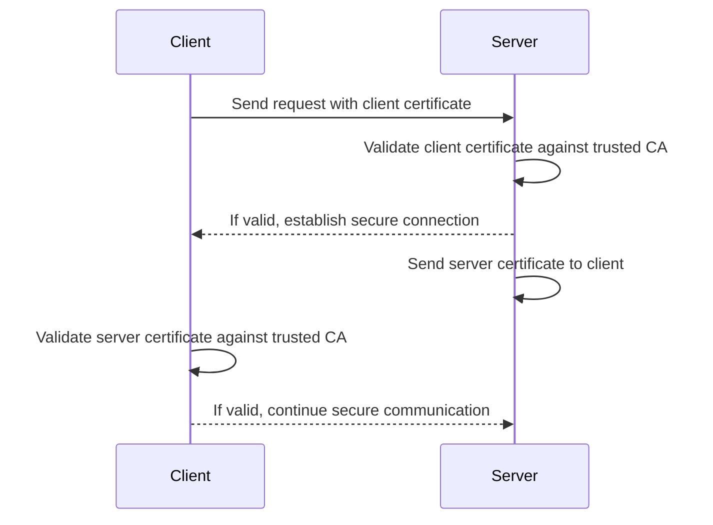

# Building Secure gRPC Services with Mutual TLS in Go: A Complete Banking Service Implementation

## Introduction

Contemporary microservices architectures require comprehensive authentication frameworks and end-to-end encryption protocols to maintain security posture. While traditional API security often relies on tokens or API keys, certificate-based mutual TLS (mTLS) provides a more secure foundation for service-to-service communication by ensuring both parties authenticate each other through cryptographic certificates.

This article demonstrates how to build a complete secure banking service using gRPC with mutual TLS authentication in Go. We'll explore both server and client implementations, diving deep into the security configuration, certificate management and practical deployment considerations that make this approach production-ready.

> **Source Code**: The complete source code for this public note is available on [GitHub](https://github.com/liambeeton/go-grpc-over-mtls)

## Why Mutual TLS for gRPC?

Traditional TLS secures the connection and authenticates the server to the client. Mutual TLS goes further by also requiring the client to present a valid certificate, creating bidirectional authentication. This is particularly valuable for:

- **Service-to-service communication** where both endpoints need verification
- **High-security environments** requiring strong authentication beyond API keys
- **Compliance requirements** that mandate certificate-based authentication
- **Zero-trust architectures** where no connection is trusted by default

Combined with gRPC's efficient Protocol Buffers serialization and HTTP/2 transport, mTLS provides both security and performance benefits for distributed systems.



## System Architecture

Our banking service demonstrates a complete mTLS implementation with these components:

- **gRPC Server**: Hosts the banking service with certificate validation
- **gRPC Client**: Consumes the service with client certificate authentication
- **Protocol**: gRPC over HTTP/2 with enforced TLS 1.3
- **Authentication**: Bidirectional certificate verification using a shared Certificate Authority

The service provides four fundamental banking operations: account creation, balance inquiry, deposits and withdrawals, all secured through mutual certificate authentication.

## Service Definition and Implementation

### Core Service Structure

The server implements a simple in-memory banking service:

```go
type server struct {
    service.UnimplementedBankServiceServer
    accounts map[string]float64
}
```

This structure embeds the generated gRPC server interface and maintains account balances in memory. While not production-suitable for persistence, it clearly demonstrates the security implementation without database complexity.

### Banking Operations

Each operation follows gRPC best practices for error handling and response formatting:

**Account Creation**:
```go
func (s *server) CreateAccount(_ context.Context, req *message.CreateAccountRequest) (*message.CreateAccountResponse, error) {
    s.accounts[req.AccountId] = 0
    return &message.CreateAccountResponse{AccountId: req.AccountId}, nil
}
```

**Balance Inquiry with Error Handling**:
```go
func (s *server) GetBalance(_ context.Context, req *message.GetBalanceRequest) (*message.GetBalanceResponse, error) {
    balance, exists := s.accounts[req.AccountId]
    if !exists {
        return nil, status.Error(codes.NotFound, "Account not found")
    }
    return &message.GetBalanceResponse{AccountId: req.AccountId, Balance: balance}, nil
}
```

**Withdrawal with Business Logic Validation**:
```go
func (s *server) Withdraw(_ context.Context, req *message.WithdrawRequest) (*message.WithdrawResponse, error) {
    balance, exists := s.accounts[req.AccountId]
    if !exists {
        return nil, status.Error(codes.NotFound, "Account not found")
    }
    if balance < req.Amount {
        return nil, status.Error(codes.FailedPrecondition, "Insufficient funds")
    }
    s.accounts[req.AccountId] -= req.Amount
    return &message.WithdrawResponse{NewBalance: s.accounts[req.AccountId]}, nil
}
```

Notice how each operation uses appropriate gRPC status codes (`NotFound`, `FailedPrecondition`) for different error conditions, providing clients with structured error information.

## Implementing Mutual TLS

### Server-Side TLS Configuration

The server's TLS configuration enforces mutual authentication:

```go
func newServerTLS(c *config) credentials.TransportCredentials {
    // Load server's certificate and private key
    serverCert, err := tls.LoadX509KeyPair(c.CertFile, c.KeyFile)
    if err != nil {
        log.Fatalf("Failed to load server certificate and key %v", err)
    }

    // Load the Certificate Authority certificate
    trustedCert, err := os.ReadFile(c.CaFile)
    if err != nil {
        log.Fatalf("Failed to load trusted certificate %v", err)
    }

    // Create certificate pool for client validation
    certPool := x509.NewCertPool()
    if !certPool.AppendCertsFromPEM(trustedCert) {
        log.Fatalf("Failed to append trusted certificate to certificate pool %v", err)
    }

    // Configure TLS with mutual authentication
    tlsConfig := &tls.Config{
        Certificates: []tls.Certificate{serverCert},
        RootCAs:      certPool,
        ClientCAs:    certPool,      // Enables client certificate validation
        MinVersion:   tls.VersionTLS13,
        MaxVersion:   tls.VersionTLS13,
    }

    return credentials.NewTLS(tlsConfig)
}
```

Key security features:

- **TLS 1.3 Enforcement**: Uses only the latest TLS version for maximum security
- **Client Certificate Validation**: `ClientCAs` requires valid client certificates
- **Certificate Authority Trust**: Both server and client certificates must be signed by the trusted CA

### Client-Side TLS Configuration

The client configuration mirrors the server's security requirements:

```go
func newClientTLS(c *config) credentials.TransportCredentials {
    // Load client's certificate and private key
    clientCert, err := tls.LoadX509KeyPair(c.CertFile, c.KeyFile)
    if err != nil {
        log.Fatalf("Failed to load client certificate and key %v", err)
    }

    // Load the Certificate Authority certificate
    trustedCert, err := os.ReadFile(c.CaFile)
    if err != nil {
        log.Fatalf("Failed to load trusted certificate %v", err)
    }

    // Create certificate pool for server validation
    certPool := x509.NewCertPool()
    if !certPool.AppendCertsFromPEM(trustedCert) {
        log.Fatalf("Failed to append trusted certificate to certificate pool %v", err)
    }

    tlsConfig := &tls.Config{
        Certificates: []tls.Certificate{clientCert},
        RootCAs:      certPool,      // Validates server certificate
        MinVersion:   tls.VersionTLS13,
        MaxVersion:   tls.VersionTLS13,
    }

    return credentials.NewTLS(tlsConfig)
}
```

The client must present its own certificate (`clientCert`) and validate the server's certificate using the shared CA.

## Server Implementation

The server setup demonstrates proper resource management and graceful error handling:

```go
func main() {
    conf, err := newConfig()
    if err != nil {
        log.Fatalf("Failed to load config %v", err)
    }

    // Create TLS credentials
    cred := newServerTLS(conf)

    // Set up network listener
    lis, err := net.Listen("tcp", fmt.Sprintf(":%d", conf.Port))
    if err != nil {
        log.Fatalf("Failed to start listener %v", err)
    }

    // Ensure cleanup on exit
    defer func() {
        err = lis.Close()
        if err != nil {
            log.Printf("Failed to close listener %v", err)
        }
    }()

    // Create gRPC server with TLS credentials
    s := grpc.NewServer(grpc.Creds(cred))
    service.RegisterBankServiceServer(s, &server{accounts: make(map[string]float64)})

    log.Printf("Server listening at %v", lis.Addr())
    if err := s.Serve(lis); err != nil {
        log.Fatalf("Failed to serve %v", err)
    }
}
```

The server lifecycle includes proper resource cleanup using defer statements, ensuring network resources are released even if the server terminates unexpectedly.

## Client Implementation and Usage Patterns

### Establishing Secure Connection

The client demonstrates proper connection management with timeout handling:

```go
func main() {
    conf, err := newConfig()
    if err != nil {
        log.Fatalf("Failed to load config %v", err)
    }

    // Create client TLS credentials
    cred := newClientTLS(conf)

    // Establish secure connection
    conn, err := grpc.NewClient(
        fmt.Sprintf("%s:%d", conf.Host, conf.Port),
        grpc.WithTransportCredentials(cred),
    )
    if err != nil {
        log.Fatalf("Unable to connect gRPC channel %v", err)
    }

    // Ensure connection cleanup
    defer func() {
        err = conn.Close()
        if err != nil {
            log.Printf("Unable to close gRPC channel %v", err)
        }
    }()

    // Create service client
    c := service.NewBankServiceClient(conn)
```

### Complete Banking Workflow

The client demonstrates a realistic banking session with proper context management:

```go
    // Set timeout for all operations
    ctx, cancel := context.WithTimeout(context.Background(), time.Second)
    defer cancel()

    // 1. Create Account
    createResp, err := c.CreateAccount(ctx, &message.CreateAccountRequest{AccountId: "12345"})
    if err != nil {
        log.Fatalf("Could not create account %v", err)
    }
    log.Printf("Account created %v", createResp.AccountId)

    // 2. Deposit Funds
    depositResp, err := c.Deposit(ctx, &message.DepositRequest{AccountId: "12345", Amount: 100.0})
    if err != nil {
        log.Fatalf("Could not deposit %v", err)
    }
    log.Printf("New balance after deposit %v", depositResp.NewBalance)

    // 3. Check Balance
    balanceResp, err := c.GetBalance(ctx, &message.GetBalanceRequest{AccountId: "12345"})
    if err != nil {
        log.Fatalf("Could not get balance %v", err)
    }
    log.Printf("Balance %v", balanceResp.Balance)

    // 4. Withdraw Funds
    withdrawResp, err := c.Withdraw(ctx, &message.WithdrawRequest{AccountId: "12345", Amount: 50.0})
    if err != nil {
        log.Fatalf("Could not withdraw %v", err)
    }
    log.Printf("New balance after withdrawal %v", withdrawResp.NewBalance)
}
```

This workflow demonstrates:

- **Context-based timeouts** for request deadline management
- **Sequential operations** showing logical banking flow
- **Error handling** at each step
- **Response processing** with logging for verification

## Certificate Infrastructure and Management

### Certificate Authority Setup

For production deployment, you'll need a complete certificate infrastructure:

```bash
# 1. Generate CA private key
openssl genrsa -out ca-key.pem 4096

# 2. Generate CA certificate
openssl req -new -x509 -key ca-key.pem -sha256 -subj "/C=US/ST=CA/O=MyOrg/CN=MyCA" -days 3650 -out ca-cert.pem

# 3. Generate server private key
openssl genrsa -out server-key.pem 4096

# 4. Generate server certificate signing request
openssl req -new -key server-key.pem -out server.csr -config server.conf

# 5. Generate server certificate signed by CA
openssl x509 -req -in server.csr -CA ca-cert.pem -CAkey ca-key.pem -out server-cert.pem -days 365 -extensions v3_ext -extfile server.conf

# 6. Generate client certificates (repeat for each client)
openssl genrsa -out client-key.pem 4096
openssl req -new -key client-key.pem -out client.csr -subj "/C=US/ST=CA/O=MyOrg/CN=client"
openssl x509 -req -in client.csr -CA ca-cert.pem -CAkey ca-key.pem -out client-cert.pem -days 365
```

### Certificate Distribution Strategy

**Server Requirements**:
- `server-cert.pem` and `server-key.pem`: Server's identity
- `ca-cert.pem`: To validate client certificates

**Client Requirements**:
- `client-cert.pem` and `client-key.pem`: Client's identity
- `ca-cert.pem`: To validate server certificate

**Security Considerations**:
- Private keys must never be shared between entities
- Certificate distribution should use secure channels
- Implement certificate rotation before expiration
- Monitor certificate validity and automate renewal

## Production Considerations

### Performance and Scalability

**Connection Management**:
```go
// Production client should reuse connections
var (
    conn *grpc.ClientConn
    client service.BankServiceClient
)

// Initialize once, reuse for multiple operations
func initClient() error {
    cred := newClientTLS(conf)
    var err error
    conn, err = grpc.NewClient(serverAddr, grpc.WithTransportCredentials(cred))
    if err != nil {
        return err
    }
    client = service.NewBankServiceClient(conn)
    return nil
}
```

**Error Handling and Resilience**:
```go
// Implement retry logic with exponential backoff
func callWithRetry(ctx context.Context, operation func() error) error {
    backoff := time.Millisecond * 100
    for i := 0; i < 3; i++ {
        if err := operation(); err != nil {
            if i == 2 { // Last attempt
                return err
            }
            time.Sleep(backoff)
            backoff *= 2
            continue
        }
        return nil
    }
    return nil
}
```

### Security Hardening

**Enhanced TLS Configuration**:
```go
tlsConfig := &tls.Config{
    Certificates: []tls.Certificate{serverCert},
    ClientCAs:    certPool,
    ClientAuth:   tls.RequireAndVerifyClientCert, // Strict client verification
    MinVersion:   tls.VersionTLS13,
    MaxVersion:   tls.VersionTLS13,
    CipherSuites: []uint16{
        tls.TLS_AES_256_GCM_SHA384,
        tls.TLS_CHACHA20_POLY1305_SHA256,
    },
}
```

**Monitoring and Logging**:
```go
// Add interceptors for monitoring
s := grpc.NewServer(
    grpc.Creds(cred),
    grpc.UnaryInterceptor(loggingInterceptor),
    grpc.StreamInterceptor(streamLoggingInterceptor),
)

func loggingInterceptor(ctx context.Context, req interface{}, info *grpc.UnaryServerInfo, handler grpc.UnaryHandler) (interface{}, error) {
    start := time.Now()
    resp, err := handler(ctx, req)
    log.Printf("Method: %s, Duration: %v, Error: %v", info.FullMethod, time.Since(start), err)
    return resp, err
}
```

## Testing Strategy

### Unit Testing Service Methods

```go
func TestCreateAccount(t *testing.T) {
    s := &server{accounts: make(map[string]float64)}

    req := &message.CreateAccountRequest{AccountId: "test123"}
    resp, err := s.CreateAccount(context.Background(), req)

    assert.NoError(t, err)
    assert.Equal(t, "test123", resp.AccountId)
    assert.Equal(t, float64(0), s.accounts["test123"])
}

func TestWithdrawInsufficientFunds(t *testing.T) {
    s := &server{accounts: map[string]float64{"test123": 50.0}}

    req := &message.WithdrawRequest{AccountId: "test123", Amount: 100.0}
    _, err := s.Withdraw(context.Background(), req)

    assert.Error(t, err)
    assert.Equal(t, codes.FailedPrecondition, status.Code(err))
}
```

### Integration Testing with mTLS

```go
func TestFullWorkflow(t *testing.T) {
    // Start test server with test certificates
    server := startTestServer(t)
    defer server.Stop()

    // Create test client with test certificates
    client := createTestClient(t)
    defer client.Close()

    ctx := context.Background()

    // Test complete workflow
    _, err := client.CreateAccount(ctx, &message.CreateAccountRequest{AccountId: "integration-test"})
    assert.NoError(t, err)

    // Continue with deposit, balance check, withdrawal tests...
}
```

## Deployment Architecture

### Kubernetes Deployment

```yaml
apiVersion: apps/v1
kind: Deployment
metadata:
  name: banking-service
spec:
  replicas: 3
  selector:
    matchLabels:
      app: banking-service
  template:
    metadata:
      labels:
        app: banking-service
    spec:
      containers:
      - name: banking-service
        image: banking-service:latest
        ports:
        - containerPort: 8080
        env:
        - name: TLS_CERT_FILE
          value: "/etc/certs/server-cert.pem"
        - name: TLS_KEY_FILE
          value: "/etc/certs/server-key.pem"
        - name: CA_CERT_FILE
          value: "/etc/certs/ca-cert.pem"
        volumeMounts:
        - name: certs
          mountPath: "/etc/certs"
          readOnly: true
      volumes:
      - name: certs
        secret:
          secretName: banking-service-certs
```

### Service Mesh Integration

When deploying in a service mesh like Istio, mTLS can be handled at the infrastructure level:

```yaml
apiVersion: security.istio.io/v1beta1
kind: PeerAuthentication
metadata:
  name: banking-service-mtls
spec:
  selector:
    matchLabels:
      app: banking-service
  mtls:
    mode: STRICT
```

However, application-level mTLS provides additional benefits:
- **Identity verification** beyond just encryption
- **Fine-grained access control** based on certificate attributes
- **Independence from infrastructure** allowing deployment flexibility

## Conclusion

Implementing gRPC with mutual TLS in Go provides a robust foundation for secure microservice communication. This banking service example demonstrates the key components needed for production deployment:

**Security Benefits**:
- Bidirectional authentication ensures both client and server identity
- TLS 1.3 enforcement provides state-of-the-art encryption
- Certificate-based access control enables fine-grained authorization

**Implementation Highlights**:
- Clean separation between business logic and security configuration
- Proper resource management with graceful cleanup
- Comprehensive error handling with gRPC status codes
- Context-based timeout management for reliable operations

**Production Readiness**:
- Complete certificate infrastructure management
- Performance considerations for connection reuse
- Monitoring and logging integration points
- Testing strategies for both unit and integration scenarios

While this example uses in-memory storage for simplicity, the security implementation patterns shown here scale directly to production systems with persistent storage, load balancing and distributed deployment.

The combination of gRPC's efficiency and mTLS security creates a powerful foundation for modern microservice architectures, particularly in environments where strong authentication and compliance requirements are paramount.

For teams building secure distributed systems, this implementation provides a practical starting point that can be extended with additional features like audit logging, rate limiting and advanced authorization policies while maintaining the core security guarantees of mutual TLS authentication.