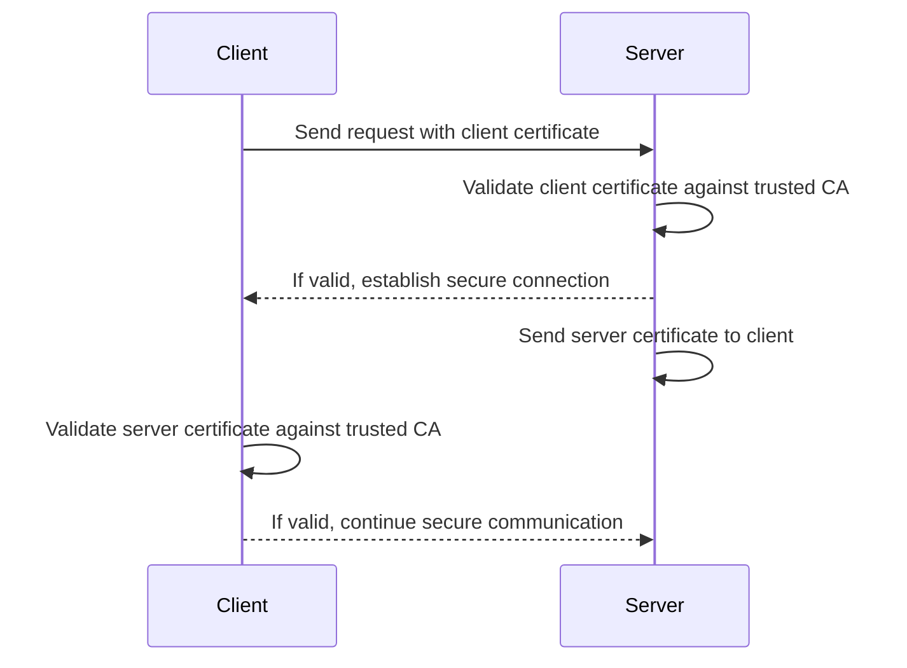

# Secure gRPC over mTLS using Go

In today's distributed systems landscape, secure communication between services is not just a nice-to-have—it's a necessity. When building microservices, gRPC has emerged as a powerful protocol for service-to-service communication due to its performance, language-agnostic nature, and strong typing. But how do we ensure these communications remain secure?

Enter Mutual TLS (mTLS)—a security protocol that provides bidirectional authentication, ensuring both the client and server verify each other's identity before establishing a connection. In this post, we'll dive deep into implementing a secure gRPC service in Go using mTLS.

> **Source Code**: The complete source code for this tutorial is available on [GitHub](https://github.com/liambeeton/go-grpc-over-mtls)

## Understanding mTLS

Traditional TLS (Transport Layer Security) provides a one-way authentication where the client verifies the server's identity. In contrast, mTLS extends this by also requiring the server to verify the client's identity. This mutual verification creates a much stronger security posture, particularly suitable for service-to-service communication where both parties should trust each other.

Key benefits of mTLS include:

1. **Mutual Authentication**: Both client and server authenticate each other
2. **Encryption**: All data transmitted is encrypted
3. **Integrity**: Detection of any tampering during transmission
4. **Authorization**: Fine-grained access control based on client certificates



## Understanding gRPC Remote Procedure Calls

Before diving into our secure banking service, let's understand what makes gRPC a powerful choice for service-to-service communication.

gRPC (gRPC Remote Procedure Calls) is a high-performance, open-source RPC framework initially developed by Google. Unlike traditional REST APIs that typically use JSON over HTTP/1.1, gRPC uses Protocol Buffers (protobuf) as its Interface Definition Language (IDL) and leverages HTTP/2 for transport.

### Key Features of gRPC

1. **Protocol Buffers**: A language-neutral, platform-neutral, extensible mechanism for serializing structured data. It's smaller, faster, and simpler than XML or JSON.

2. **HTTP/2 Transport**: Provides benefits like multiplexing (multiple requests/responses over a single connection), bidirectional streaming, header compression, and binary framing.

3. **Strong Typing**: The service interface is defined in `.proto` files, which are used to generate client and server code in various languages, ensuring type safety.

4. **Four Communication Patterns**:
   - **Unary RPC**: Traditional request-response model
   - **Server Streaming RPC**: Server sends a stream of responses to a client request
   - **Client Streaming RPC**: Client sends a stream of requests to the server
   - **Bidirectional Streaming RPC**: Both client and server send streams of messages

### Advantages of gRPC

- **Performance**: Significantly faster than REST+JSON due to binary serialization and HTTP/2
- **Code Generation**: Automatic client and server code generation in multiple languages
- **Strong Contract**: Clear service definition through `.proto` files
- **Streaming Support**: Native support for streaming data
- **Deadlines/Timeouts**: Ability to specify how long a client is willing to wait
- **Cancellation**: Clients can cancel in-progress calls

### How gRPC Works

1. **Define Services**: Create `.proto` files defining service methods and message types
2. **Generate Code**: Use the protoc compiler with appropriate plugins to generate code
3. **Implement Server**: Create server implementations of the generated interfaces
4. **Implement Client**: Use generated client code to make RPC calls

For our banking example, we define our service in a `.proto` file (not shown in the code examples), which might look something like:

```protobuf
syntax = "proto3";

package banking;

service BankService {
  rpc CreateAccount(CreateAccountRequest) returns (CreateAccountResponse);
  rpc GetBalance(GetBalanceRequest) returns (GetBalanceResponse);
  rpc Deposit(DepositRequest) returns (DepositResponse);
  rpc Withdraw(WithdrawRequest) returns (WithdrawResponse);
}

message CreateAccountRequest {
  string account_id = 1;
}

message CreateAccountResponse {
  string account_id = 1;
}

// Additional message definitions...
```

This service definition is compiled into Go code using the protobuf compiler, generating the interfaces and message types our implementation uses.

## Building a Secure Banking gRPC Service

To demonstrate mTLS in action, we'll examine a simple banking service implemented in Go. This service allows clients to create accounts, check balances, and perform deposits and withdrawals—all protected by mTLS.

### The Service Definition

Our banking service is defined with four operations:

1. `CreateAccount`: Opens a new account with an initial balance of 0
2. `GetBalance`: Retrieves the current balance for an account
3. `Deposit`: Adds funds to an account
4. `Withdraw`: Removes funds from an account (if sufficient balance exists)

### Server Implementation

Let's look at the core server implementation:

```go
type server struct {
    service.UnimplementedBankServiceServer
    accounts map[string]float64
}

func (s *server) CreateAccount(_ context.Context, req *message.CreateAccountRequest) (*message.CreateAccountResponse, error) {
    s.accounts[req.AccountId] = 0
    return &message.CreateAccountResponse{AccountId: req.AccountId}, nil
}

func (s *server) GetBalance(_ context.Context, req *message.GetBalanceRequest) (*message.GetBalanceResponse, error) {
    balance, exists := s.accounts[req.AccountId]
    if !exists {
        return nil, status.Error(codes.NotFound, "Account not found")
    }
    return &message.GetBalanceResponse{AccountId: req.AccountId, Balance: balance}, nil
}

func (s *server) Deposit(_ context.Context, req *message.DepositRequest) (*message.DepositResponse, error) {
    _, exists := s.accounts[req.AccountId]
    if !exists {
        return nil, status.Error(codes.NotFound, "Account not found")
    }
    s.accounts[req.AccountId] += req.Amount
    return &message.DepositResponse{NewBalance: s.accounts[req.AccountId]}, nil
}

func (s *server) Withdraw(_ context.Context, req *message.WithdrawRequest) (*message.WithdrawResponse, error) {
    balance, exists := s.accounts[req.AccountId]
    if !exists {
        return nil, status.Error(codes.NotFound, "Account not found")
    }
    if balance < req.Amount {
        return nil, status.Error(codes.FailedPrecondition, "Insufficient funds")
    }
    s.accounts[req.AccountId] -= req.Amount
    return &message.WithdrawResponse{NewBalance: s.accounts[req.AccountId]}, nil
}
```

The implementation is straightforward—we use an in-memory map to store account balances and implement the four service methods. Each method performs appropriate validation before executing the requested operation.

## Setting Up mTLS

Now for the exciting part—securing this service with mTLS! This requires several components:

1. A Certificate Authority (CA) certificate
2. A server certificate and private key
3. Client certificates and private keys (for clients to authenticate)
4. TLS configuration for the gRPC server

### Creating the Server's TLS Configuration

The `newServerTLS` function is where the magic happens:

```go
func newServerTLS(c *config) credentials.TransportCredentials {
    // Load the server certificate and its key
    serverCert, err := tls.LoadX509KeyPair(c.CertFile, c.KeyFile)
    if err != nil {
        log.Fatalf("Failed to load server certificate and key %v", err)
    }

    // Load the CA certificate
    trustedCert, err := os.ReadFile(c.CaFile)
    if err != nil {
        log.Fatalf("Failed to load trusted certificate %v", err)
    }

    // Put the CA certificate into the certificate pool
    certPool := x509.NewCertPool()
    if !certPool.AppendCertsFromPEM(trustedCert) {
        log.Fatalf("Failed to append trusted certificate to certificate pool %v", err)
    }

    // Create the TLS configuration
    tlsConfig := &tls.Config{
        Certificates: []tls.Certificate{serverCert},
        RootCAs:      certPool,
        ClientCAs:    certPool,
        MinVersion:   tls.VersionTLS13,
        MaxVersion:   tls.VersionTLS13,
    }

    // Return new TLS credentials based on the TLS configuration
    return credentials.NewTLS(tlsConfig)
}
```

Let's break down what's happening:

1. **Loading Server Credentials**: We load the server's certificate and private key using `tls.LoadX509KeyPair`.
2. **Setting Up Trust**: We read the CA certificate and add it to a certificate pool. This pool defines which certificates are trusted.
3. **Configuring TLS**: We create a TLS configuration that:
   - Includes the server's certificate
   - Uses the CA certificate pool to verify both the server (`RootCAs`) and clients (`ClientCAs`)
   - Enforces TLS 1.3 for maximum security
4. **Creating Credentials**: Finally, we create gRPC-compatible credentials from our TLS configuration.

### Starting the Secure gRPC Server

With the TLS configuration in place, we can start our secure gRPC server:

```go
func main() {
    // Load config
    conf, err := newConfig()
    if err != nil {
        log.Fatalf("Failed to load config %v", err)
    }

    // Print config
    fmt.Printf("Host: %s\n", conf.Host)
    fmt.Printf("Port: %d\n", conf.Port)
    fmt.Printf("CA File: %s\n", conf.CaFile)
    fmt.Printf("Key File: %s\n", conf.KeyFile)
    fmt.Printf("Cert File: %s\n", conf.CertFile)

    // Get TLS credentials
    cred := newServerTLS(conf)

    // Create a listener that listens to localhost port 8443
    lis, err := net.Listen("tcp", fmt.Sprintf(":%d", conf.Port))
    if err != nil {
        log.Fatalf("Failed to start listener %v", err)
    }

    // Close the listener when containing function terminates
    defer func() {
        err = lis.Close()
        if err != nil {
            log.Printf("Failed to close listener %v", err)
        }
    }()

    // Create a new gRPC server
    s := grpc.NewServer(grpc.Creds(cred))
    service.RegisterBankServiceServer(s, &server{accounts: make(map[string]float64)})

    // Start the gRPC server
    log.Printf("Server listening at %v", lis.Addr())
    if err := s.Serve(lis); err != nil {
        log.Fatalf("Failed to serve %v", err)
    }
}
```

The key part is `grpc.NewServer(grpc.Creds(cred))`, where we create the gRPC server with our TLS credentials.

## Client Implementation for mTLS

Let's examine a complete client implementation that authenticates with our mTLS-protected server:

```go
func main() {
    // Load config
    conf, err := newConfig()
    if err != nil {
        log.Fatalf("Failed to load config %v", err)
    }

    // Print config
    fmt.Printf("Host: %s\n", conf.Host)
    fmt.Printf("Port: %d\n", conf.Port)
    fmt.Printf("CA File: %s\n", conf.CaFile)
    fmt.Printf("Key File: %s\n", conf.KeyFile)
    fmt.Printf("Cert File: %s\n", conf.CertFile)

    // Get TLS credentials
    cred := newClientTLS(conf)

    // Dial the gRPC server with the given credentials
    log.Printf("Client connecting to %s:%d", conf.Host, conf.Port)
    conn, err := grpc.NewClient(fmt.Sprintf("%s:%d", conf.Host, conf.Port), grpc.WithTransportCredentials(cred))
    if err != nil {
        log.Fatalf("Unable to connect gRPC channel %v", err)
    }

    // Close the listener when containing function terminates
    defer func() {
        err = conn.Close()
        if err != nil {
            log.Printf("Unable to close gRPC channel %v", err)
        }
    }()

    // Create the gRPC client
    c := service.NewBankServiceClient(conn)

    ctx, cancel := context.WithTimeout(context.Background(), time.Second)
    defer cancel()

    // Create account
    createResp, err := c.CreateAccount(ctx, &message.CreateAccountRequest{AccountId: "12345"})
    if err != nil {
        log.Fatalf("Could not create account %v", err)
    }
    log.Printf("Account created %v", createResp.AccountId)

    // Deposit
    depositResp, err := c.Deposit(ctx, &message.DepositRequest{AccountId: "12345", Amount: 100.0})
    if err != nil {
        log.Fatalf("Could not deposit %v", err)
    }
    log.Printf("New balance after deposit %v", depositResp.NewBalance)

    // Get balance
    balanceResp, err := c.GetBalance(ctx, &message.GetBalanceRequest{AccountId: "12345"})
    if err != nil {
        log.Fatalf("Could not get balance %v", err)
    }
    log.Printf("Balance %v", balanceResp.Balance)

    // Withdraw
    withdrawResp, err := c.Withdraw(ctx, &message.WithdrawRequest{AccountId: "12345", Amount: 50.0})
    if err != nil {
        log.Fatalf("Could not withdraw %v", err)
    }
    log.Printf("New balance after withdrawal %v", withdrawResp.NewBalance)
}

func newClientTLS(c *config) credentials.TransportCredentials {
    // Load the client certificate and its key
    clientCert, err := tls.LoadX509KeyPair(c.CertFile, c.KeyFile)
    if err != nil {
        log.Fatalf("Failed to load client certificate and key %v", err)
    }

    // Load the CA certificate
    trustedCert, err := os.ReadFile(c.CaFile)
    if err != nil {
        log.Fatalf("Failed to load trusted certificate %v", err)
    }

    // Put the CA certificate into the certificate pool
    certPool := x509.NewCertPool()
    if !certPool.AppendCertsFromPEM(trustedCert) {
        log.Fatalf("Failed to append trusted certificate to certificate pool %v", err)
    }

    // Create the TLS configuration
    tlsConfig := &tls.Config{
        Certificates: []tls.Certificate{clientCert},
        RootCAs:      certPool,
        MinVersion:   tls.VersionTLS13,
        MaxVersion:   tls.VersionTLS13,
    }

    // Return new TLS credentials based on the TLS configuration
    return credentials.NewTLS(tlsConfig)
}
```

This client code shows the complete workflow:

1. First, we load the same configuration structure used by the server
2. We create the TLS credentials with the client's certificate and the CA certificate
3. We establish a gRPC connection using these credentials
4. Finally, we perform a series of banking operations by calling the service methods

## Key Observations from the Client Code

Looking at the client implementation, there are several important aspects to note:

1. **TLS Version Enforcement**: Both client and server explicitly set `MinVersion` and `MaxVersion` to TLS 1.3, ensuring the use of the most secure TLS version available.

   ```go
   tlsConfig := &tls.Config{
       Certificates: []tls.Certificate{clientCert},
       RootCAs:      certPool,
       MinVersion:   tls.VersionTLS13,
       MaxVersion:   tls.VersionTLS13,
   }
   ```

2. **Context with Timeout**: The client sets a timeout for RPC operations, preventing indefinite hanging:

   ```go
   ctx, cancel := context.WithTimeout(context.Background(), time.Second)
   defer cancel()
   ```

3. **Error Handling**: Throughout the code, errors are properly checked and logged, which is crucial for debugging TLS-related issues.

4. **Resource Cleanup**: The client properly closes connections using deferred functions:

   ```go
   defer func() {
       err = conn.Close()
       if err != nil {
           log.Printf("Unable to close gRPC channel %v", err)
       }
   }()
   ```

## Best Practices for Production

When implementing mTLS in production environments, consider these best practices:

1. **Certificate Rotation**: Regularly rotate certificates to minimize the impact of potential key compromise
2. **Certificate Revocation**: Implement a process to revoke certificates when necessary
3. **Secure Storage**: Store private keys securely, ideally using a dedicated secrets management solution
4. **Monitoring**: Monitor for certificate expiration and authentication failures
5. **Automation**: Use automation for certificate management to reduce human error
6. **Timeout Management**: Always use contexts with appropriate timeouts for RPC calls
7. **Resource Management**: Ensure proper cleanup of resources with deferred functions

## Understanding the Complete mTLS Workflow

Now that we've seen both the server and client implementations, let's understand the complete mTLS workflow:

1. **Certificate Setup**: Both client and server have their own certificates signed by a common Certificate Authority (CA)
2. **Server Configuration**: The server loads its certificate and the CA certificate, then configures the gRPC server with these credentials
3. **Client Configuration**: Similarly, the client loads its certificate and the CA certificate
4. **Connection Establishment**:
   - The client initiates a connection to the server
   - The server presents its certificate
   - The client verifies the server's certificate against the CA
   - The client presents its certificate
   - The server verifies the client's certificate against the CA
5. **Secure Communication**: Once mutual authentication is complete, all traffic is encrypted using the negotiated TLS session

This bidirectional verification ensures that both parties are who they claim to be, creating a secure channel for communication.

## Beyond Basic mTLS

Once you have mTLS working, consider these enhancements:

1. **Certificate-Based Authorization**: Use client certificate details (like Common Name or Subject Alternative Names) to implement fine-grained authorization
2. **Certificate Transparency**: Implement logging of certificate issuance to detect possible misuse
3. **OCSP Stapling**: Enable Online Certificate Status Protocol stapling for efficient certificate revocation checking
4. **Timeout Management**: Notice the client uses `context.WithTimeout` to enforce operation timeouts, which is a good practice for all RPC calls

## Conclusion

Implementing mTLS with gRPC in Go provides a robust security foundation for your microservices. The combination of Go's strong cryptography libraries, gRPC's performance, and mTLS's bidirectional authentication creates a secure communication channel that protects your services from various threats.

While the implementation might seem complex at first, the security benefits far outweigh the additional complexity. By following the patterns outlined in this post, you can ensure that your service-to-service communications remain confidential, authenticated, and protected from tampering.

Remember, security is not a one-time implementation but an ongoing process. Regularly review and update your security practices as new threats emerge and best practices evolve.

For your reference, the complete source code used in this tutorial is available on [GitHub](https://github.com/liambeeton/go-grpc-over-mtls).

Happy secure coding!