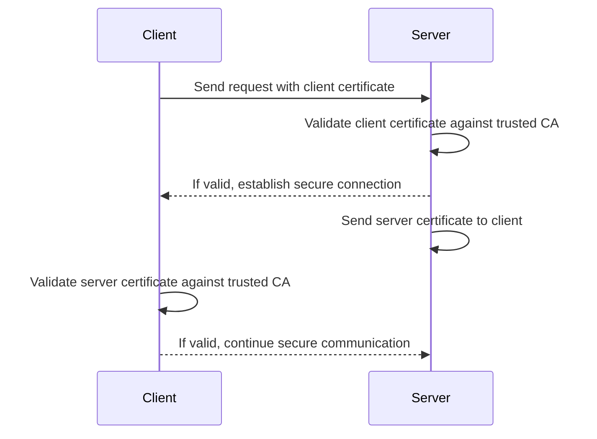
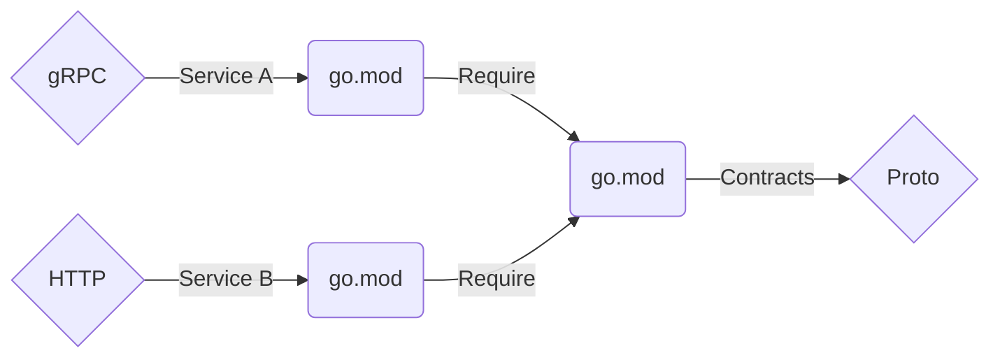

# Secure gRPC over mTLS using Go

In this post, we will guide you through the steps to create a gRPC client/server setup that is secured using mutual TLS authentication (mTLS). We'll begin with a brief introduction to mTLS and gRPC to provide the necessary context. However, a more in-depth exploration of these topics is beyond the scope of this post.

## Mutual TLS

TLS and mTLS are both protocols designed to secure communications over a network. TLS ensures privacy and data integrity by allowing clients to verify the server's identity using digital certificates, a process known as one-way TLS. This is commonly used for securing public-facing websites and applications.

In contrast, mTLS enhances security by requiring both the client and server to authenticate each other with digital certificates, providing mutual verification. This bidirectional authentication, also known as two-way TLS, is ideal for high-security environments like corporate networks and API communications where both parties need to establish trust.



## gRPC Remote Procedure Calls

[gRPC](https://grpc.io/) is an open-source framework from Google that helps different parts of an application communicate efficiently. It's great for connecting microservices, which are common in cloud-based apps. gRPC uses HTTP/2 for fast communication and [Protocol Buffers](https://protobuf.dev/) `protobuf` for compact data serialisation.

When working with gRPC in Go, you define your service methods in `protobuf` files. These files are then compiled into Go code using the `protoc` compiler with a gRPC Go plugin. This process generates both server and client code, making it easier to implement your services. On the server side, you define the methods and link them to a gRPC server. On the client side, you use the generated code to call these methods remotely, making network communication look like local function calls.



## Mock Banking Application

From this point on, all technical steps in this post are centered around Keystone Global Banking, a mock banking application. This application is perfect for showing how mutual TLS (mTLS) authentication works. This approach helps us understand how mTLS protects sensitive financial data from unauthorised access and breaches.

### Features

- mTLS Authentication: Ensures both client and server mutually verify each other's identities.
- Banking Operations: Simulates basic banking operations such as account creation, balance checking, and funds transfer.
- Secure API Endpoints: All interactions with the app are secured using mTLS.

### Source Code

You can find the code for the Keystone Global Banking (KGB) application on [GitHub](https://github.com/liambeeton/go-grpc-over-mtls).

### mTLS Certificates

By following these steps, you will generate the necessary certificates for setting up mTLS without passwords and using a separate configuration file for [OpenSSL](https://www.openssl.org/).

#### Set Up a Certificate Authority (CA)

```sh
# Create a Private Key for the CA
openssl genrsa -out ca.key 4096

# Create a Self-Signed Certificate for the CA
openssl req -x509 -new -nodes -key ca.key -sha256 -subj "/C=US/ST=New York/L=New York City/O=Example CA Inc./CN=Example Root CA" -days 365 -out ca.crt
```

#### Generate the Server Certificate

```sh
# Create a Private Key for the Server
openssl genrsa -out server.key 4096

# Create a Certificate Signing Request (CSR) config for the Server
cat > server.conf <<EOF
[ req ]
default_bits       = 2048
default_keyfile    = server.key
default_md         = sha256
prompt             = no
distinguished_name = req_distinguished_name
x509_extensions    = v3_req

[ req_distinguished_name ]
C                  = ZA
ST                 = Western Cape
L                  = Cape Town
O                  = Keystone Global Banking
OU                 = Finance
CN                 = bank.kgb.rip

[ v3_req ]
keyUsage           = keyEncipherment, dataEncipherment
extendedKeyUsage   = serverAuth
subjectAltName     = @alt_names

[ alt_names ]
DNS.1              = localhost
DNS.2              = server
DNS.3              = bank.kgb.rip
IP.1               = 127.0.0.1
EOF

# Create a Certificate Signing Request (CSR) for the Server
openssl req -new -key server.key -out server.csr -config server.conf

# Sign the Server CSR with the CA Certificate to Generate the Server Certificate
openssl x509 -req -in server.csr -CA ca.crt -CAkey ca.key -CAcreateserial -out server.crt -days 90 -sha256 -extensions v3_req -extfile server.conf
```

#### Generate the Client Certificate

```sh
# Create a Private Key for the Client
openssl genrsa -out client.key 4096

# Create a Certificate Signing Request (CSR) config for the Client
cat > client.conf <<EOF
[ req ]
default_bits        = 2048
default_keyfile     = client.key
default_md          = sha256
prompt              = no
distinguished_name  = req_distinguished_name
x509_extensions     = v3_req

[ req_distinguished_name ]
C                   = ZA
ST                  = Western Cape
L                   = Cape Town
O                   = Keystone Global Banking
OU                  = Finance
CN                  = bank.kgb.rip

[ v3_req ]
keyUsage            = keyEncipherment, dataEncipherment
extendedKeyUsage    = clientAuth
subjectAltName      = @alt_names

[ alt_names ]
DNS.1               = localhost
DNS.2               = server
DNS.3               = bank.kgb.rip
IP.1                = 127.0.0.1
EOF

# Create a Certificate Signing Request (CSR) for the Client
openssl req -new -key client.key -out client.csr -config client.conf

# Sign the Client CSR with the CA Certificate to Generate the Client Certificate
openssl x509 -req -in client.csr -CA ca.crt -CAkey ca.key -CAcreateserial -out client.crt -days 90 -sha256 -extensions v3_req -extfile client.conf
```

### Write Some Code

Let's create a simple Go application that reads configuration from a YAML file.

#### Reading Configuration Data

First, you need to install `Viper` using go get:

```sh
go get github.com/spf13/viper
```

Create a `config.go` file and initialise Viper to read from the `configs/client-config.yaml` and `configs/server-config.yaml` files:

```go
package config

import (
	"log"

	"github.com/spf13/viper"
)

type Config struct {
	App    appConfig
	Server serverConfig
	TLS    tlsConfig
}

type appConfig struct {
	Name    string
	Version string
}

type serverConfig struct {
	Port int
	Host string
}

type tlsConfig struct {
	CA   string
	Cert string
	Key  string
}

func New(name string) *Config {
	// Initialise Viper
	viper.SetConfigName(name)
	viper.SetConfigType("yaml")
	viper.AddConfigPath("configs")

	// Read in environment variables that match
	viper.AutomaticEnv()

	// Read the config file
	err := viper.ReadInConfig()
	if err != nil {
		log.Fatalf("Error reading config file %v", err)
	}

	// Unmarshal the config into a Config struct
	var config Config
	err = viper.Unmarshal(&config)
	if err != nil {
		log.Fatalf("Unable to decode into struct %v", err)
	}

	return &config
}
```

#### TLS Credentials

Load TLS credentials for the `client` and `server`.

```go
package credentials

import (
	"crypto/tls"
	"crypto/x509"
	"log"
	"os"

	"github.com/liambeeton/go-grpc-over-mtls/internal/config"

	"google.golang.org/grpc/credentials"
)

func NewClientTLS(c *config.Config) credentials.TransportCredentials {
	// Load the client certificate and its key
	clientCert, err := tls.LoadX509KeyPair(c.TLS.Cert, c.TLS.Key)
	if err != nil {
		log.Fatalf("Failed to load client certificate and key %v", err)
	}

	// Load the CA certificate
	trustedCert, err := os.ReadFile(c.TLS.CA)
	if err != nil {
		log.Fatalf("Failed to load trusted certificate %v", err)
	}

	// Put the CA certificate into the certificate pool
	certPool := x509.NewCertPool()
	if !certPool.AppendCertsFromPEM(trustedCert) {
		log.Fatalf("Failed to append trusted certificate to certificate pool %v", err)
	}

	// Create the TLS configuration
	tlsConfig := &tls.Config{
		Certificates: []tls.Certificate{clientCert},
		RootCAs:      certPool,
		MinVersion:   tls.VersionTLS13,
		MaxVersion:   tls.VersionTLS13,
	}

	// Return new TLS credentials based on the TLS configuration
	return credentials.NewTLS(tlsConfig)
}

func NewServerTLS(c *config.Config) credentials.TransportCredentials {
	// Load the server certificate and its key
	serverCert, err := tls.LoadX509KeyPair(c.TLS.Cert, c.TLS.Key)
	if err != nil {
		log.Fatalf("Failed to load server certificate and key %v", err)
	}

	// Load the CA certificate
	trustedCert, err := os.ReadFile(c.TLS.CA)
	if err != nil {
		log.Fatalf("Failed to load trusted certificate %v", err)
	}

	// Put the CA certificate into the certificate pool
	certPool := x509.NewCertPool()
	if !certPool.AppendCertsFromPEM(trustedCert) {
		log.Fatalf("Failed to append trusted certificate to certificate pool %v", err)
	}

	// Create the TLS configuration
	tlsConfig := &tls.Config{
		Certificates: []tls.Certificate{serverCert},
		RootCAs:      certPool,
		ClientCAs:    certPool,
		MinVersion:   tls.VersionTLS13,
		MaxVersion:   tls.VersionTLS13,
	}

	// Return new TLS credentials based on the TLS configuration
	return credentials.NewTLS(tlsConfig)
}
```

#### Protobuf Generation

Next, you need install `gRPC` and `Protobuf` using go get:

```sh
go get google.golang.org/grpc
go get google.golang.org/protobuf
```

Use `make proto-compile` to generate the protobuf files.

```protobuf
syntax = "proto3";

package bank.service.v1;

option go_package = "github.com/liambeeton/go-grpc-over-mtls/pb/message";

message CreateAccountRequest {
  string account_id = 1;
}

message CreateAccountResponse {
  string account_id = 1;
}

message GetBalanceRequest {
  string account_id = 1;
}

message GetBalanceResponse {
  string account_id = 1;
  double balance = 2;
}

message DepositRequest {
  string account_id = 1;
  double amount = 2;
}

message DepositResponse {
  double new_balance = 1;
}

message WithdrawRequest {
  string account_id = 1;
  double amount = 2;
}

message WithdrawResponse {
  double new_balance = 1;
}
```

```protobuf
syntax = "proto3";

package bank.service.v1;

option go_package = "github.com/liambeeton/go-grpc-over-mtls/pb/service";

import "message.proto";

service BankService {
  rpc CreateAccount(CreateAccountRequest) returns (CreateAccountResponse);
  rpc GetBalance(GetBalanceRequest) returns (GetBalanceResponse);
  rpc Deposit(DepositRequest) returns (DepositResponse);
  rpc Withdraw(WithdrawRequest) returns (WithdrawResponse);
}
```

#### gRPC Server

We will create a main Go file with the primary function of starting the gRPC server. The code snippet below demonstrates this. I've also included comments within the code to provide clearer explanations of the key sections.

```go
package main

import (
	"context"
	"fmt"
	"log"
	"net"

	"github.com/liambeeton/go-grpc-over-mtls/internal/config"
	"github.com/liambeeton/go-grpc-over-mtls/internal/credentials"
	"github.com/liambeeton/go-grpc-over-mtls/pb/message"
	"github.com/liambeeton/go-grpc-over-mtls/pb/service"

	"google.golang.org/grpc"
	"google.golang.org/grpc/codes"
	"google.golang.org/grpc/status"
)

type server struct {
	service.UnimplementedBankServiceServer
	accounts map[string]float64
}

func (s *server) CreateAccount(_ context.Context, req *message.CreateAccountRequest) (*message.CreateAccountResponse, error) {
	s.accounts[req.AccountId] = 0
	return &message.CreateAccountResponse{AccountId: req.AccountId}, nil
}

func (s *server) GetBalance(_ context.Context, req *message.GetBalanceRequest) (*message.GetBalanceResponse, error) {
	balance, exists := s.accounts[req.AccountId]
	if !exists {
		return nil, status.Error(codes.NotFound, "Account not found")
	}
	return &message.GetBalanceResponse{AccountId: req.AccountId, Balance: balance}, nil
}

func (s *server) Deposit(_ context.Context, req *message.DepositRequest) (*message.DepositResponse, error) {
	_, exists := s.accounts[req.AccountId]
	if !exists {
		return nil, status.Error(codes.NotFound, "Account not found")
	}
	s.accounts[req.AccountId] += req.Amount
	return &message.DepositResponse{NewBalance: s.accounts[req.AccountId]}, nil
}

func (s *server) Withdraw(_ context.Context, req *message.WithdrawRequest) (*message.WithdrawResponse, error) {
	balance, exists := s.accounts[req.AccountId]
	if !exists {
		return nil, status.Error(codes.NotFound, "Account not found")
	}
	if balance < req.Amount {
		return nil, status.Error(codes.FailedPrecondition, "Insufficient funds")
	}
	s.accounts[req.AccountId] -= req.Amount
	return &message.WithdrawResponse{NewBalance: s.accounts[req.AccountId]}, nil
}

func main() {
	// Load app config
	config := config.New("server-config")

	// Print out the loaded configuration
	fmt.Printf("App Name: %s\n", config.App.Name)
	fmt.Printf("App Version: %s\n", config.App.Version)
	fmt.Printf("Server Host: %s\n", config.Server.Host)
	fmt.Printf("Server Port: %d\n", config.Server.Port)
	fmt.Printf("CA File: %s\n", config.TLS.CA)
	fmt.Printf("Cert File: %s\n", config.TLS.Cert)
	fmt.Printf("Key File: %s\n", config.TLS.Key)

	// Get TLS credentials
	cred := credentials.NewServerTLS(config)

	// Create a listener that listens to localhost port 8443
	lis, err := net.Listen("tcp", fmt.Sprintf(":%d", config.Server.Port))
	if err != nil {
		log.Fatalf("Failed to start listener %v", err)
	}

	// Close the listener when containing function terminates
	defer func() {
		err = lis.Close()
		if err != nil {
			log.Printf("Failed to close listener %v", err)
		}
	}()

	// Create a new gRPC server
	s := grpc.NewServer(grpc.Creds(cred))
	service.RegisterBankServiceServer(s, &server{accounts: make(map[string]float64)})

	// Start the gRPC server
	log.Printf("Server listening at %v", lis.Addr())
	if err := s.Serve(lis); err != nil {
		log.Fatalf("Failed to serve %v", err)
	}
}
```

#### gRPC Client

The final step is to develop the code for the gRPC client. Below is the code I used to create the client.

```go
package main

import (
	"context"
	"fmt"
	"log"
	"time"

	"github.com/liambeeton/go-grpc-over-mtls/internal/config"
	"github.com/liambeeton/go-grpc-over-mtls/internal/credentials"
	"github.com/liambeeton/go-grpc-over-mtls/pb/message"
	"github.com/liambeeton/go-grpc-over-mtls/pb/service"

	"google.golang.org/grpc"
)

func main() {
	// Load app config
	config := config.New("client-config")

	// Print out the loaded configuration
	fmt.Printf("App Name: %s\n", config.App.Name)
	fmt.Printf("App Version: %s\n", config.App.Version)
	fmt.Printf("Server Host: %s\n", config.Server.Host)
	fmt.Printf("Server Port: %d\n", config.Server.Port)
	fmt.Printf("CA File: %s\n", config.TLS.CA)
	fmt.Printf("Cert File: %s\n", config.TLS.Cert)
	fmt.Printf("Key File: %s\n", config.TLS.Key)

	// Get TLS credentials
	cred := credentials.NewClientTLS(config)

	// Dial the gRPC server with the given credentials
	log.Printf("Client connecting to %s:%d", config.Server.Host, config.Server.Port)
	conn, err := grpc.NewClient(fmt.Sprintf("%s:%d", config.Server.Host, config.Server.Port), grpc.WithTransportCredentials(cred))
	if err != nil {
		log.Fatalf("Unable to connect gRPC channel %v", err)
	}

	// Close the listener when containing function terminates
	defer func() {
		err = conn.Close()
		if err != nil {
			log.Printf("Unable to close gRPC channel %v", err)
		}
	}()

	// Create the gRPC client
	c := service.NewBankServiceClient(conn)

	ctx, cancel := context.WithTimeout(context.Background(), time.Second)
	defer cancel()

	// Create account
	createResp, err := c.CreateAccount(ctx, &message.CreateAccountRequest{AccountId: "12345"})
	if err != nil {
		log.Fatalf("Could not create account %v", err)
	}
	log.Printf("Account created %v", createResp.AccountId)

	// Deposit
	depositResp, err := c.Deposit(ctx, &message.DepositRequest{AccountId: "12345", Amount: 100.0})
	if err != nil {
		log.Fatalf("Could not deposit %v", err)
	}
	log.Printf("New balance after deposit %v", depositResp.NewBalance)

	// Get balance
	balanceResp, err := c.GetBalance(ctx, &message.GetBalanceRequest{AccountId: "12345"})
	if err != nil {
		log.Fatalf("Could not get balance %v", err)
	}
	log.Printf("Balance %v", balanceResp.Balance)

	// Withdraw
	withdrawResp, err := c.Withdraw(ctx, &message.WithdrawRequest{AccountId: "12345", Amount: 50.0})
	if err != nil {
		log.Fatalf("Could not withdraw %v", err)
	}
	log.Printf("New balance after withdrawal %v", withdrawResp.NewBalance)
}
```
